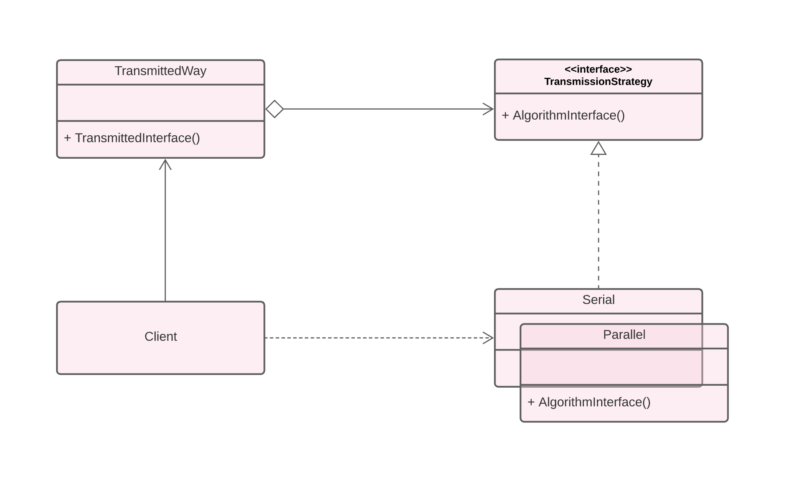
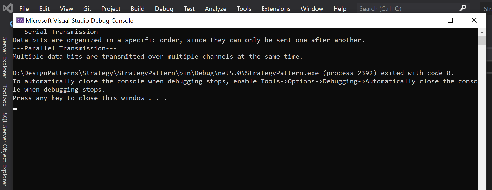

----

 

# Strategy Pattern
Strategy is a behavioral design pattern that turns a set of behaviors into objects and makes them interchangeable inside original context object.

 

## Example

 

## UML 

## Output 

 

## By:

- Samirah Alhusayni

